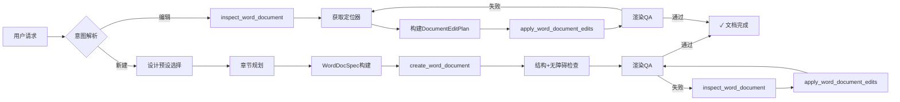
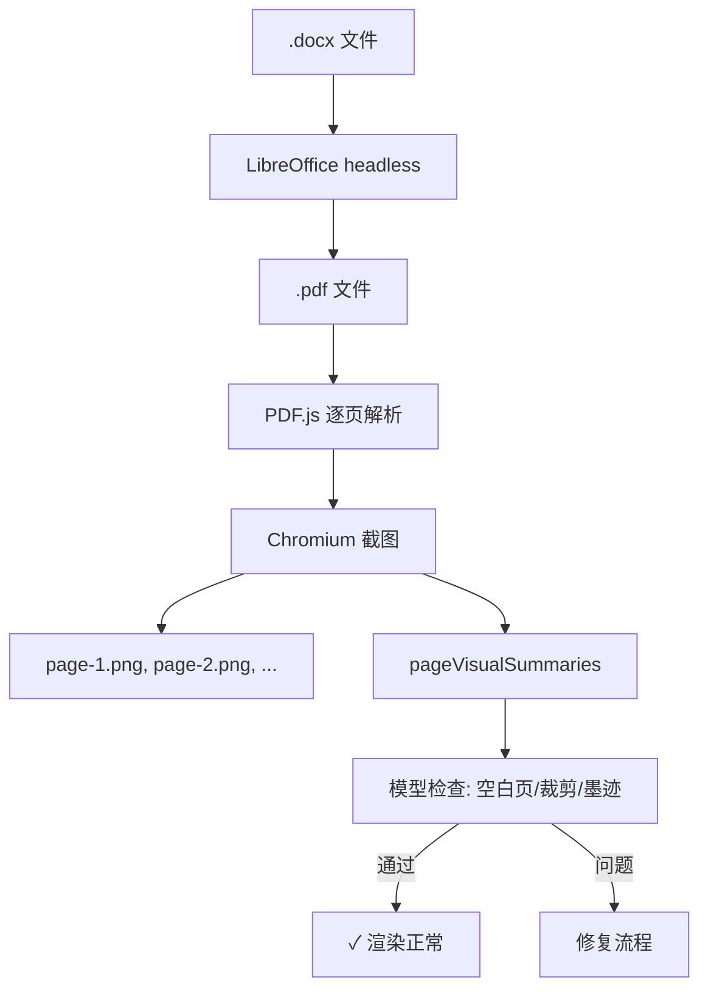
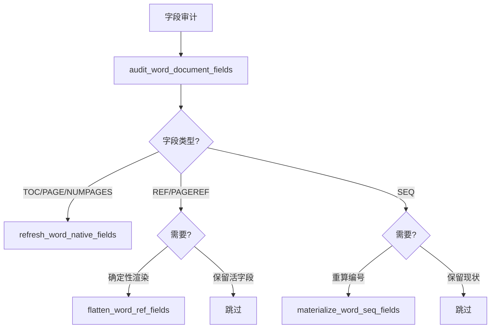
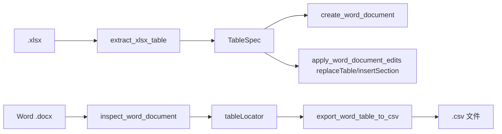

# ChipMate Word 能力实现详细架构流程

> 本文档基于 ChipMate Documents Skill v1 全部 7 个任务资源文件、脚本清单及核心工具链 API 的详细研究撰写。
> 覆盖 17+ 个工具函数、25+ 种编辑操作、5 层架构设计、4 种设计预设、15+ 种块类型、完整的域字段处理体系。

---

## 目录

1. [概述](#1-概述)
2. [五层架构总览](#2-五层架构总览)
3. [核心组件详解](#3-核心组件详解)
4. [新建文档工作流程](#4-新建文档工作流程)
5. [现有文档编辑工作流程](#5-现有文档编辑工作流程)
6. [工具链详细说明](#6-工具链详细说明)
7. [域字段处理架构](#7-域字段处理架构)
8. [文档保护与安全](#8-文档保护与安全)
9. [表格与数据集成](#9-表格与数据集成)
10. [图片与题注](#10-图片与题注)
11. [列表与超链接](#11-列表与超链接)
12. [章节与页面布局](#12-章节与页面布局)
13. [修订模式（Tracked Changes）](#13-修订模式tracked-changes)
14. [文档比较/差异](#14-文档比较差异)
15. [质量规则与最佳实践](#15-质量规则与最佳实践)
16. [已知限制与依赖](#16-已知限制与依赖)
17. [架构总结](#17-架构总结)
18. [附录：流程图表](#18-附录流程图表)

---

## 1. 概述

ChipMate Word 能力是一套完整的 Word `.docx` 文档全生命周期管理工具链，运行在 **VS Code 扩展主机（Extension Host）** 环境中。该能力通过**模型主导意图决策、工具保障确定执行、渲染验证确保质量**的三层设计原则，实现了从文档规划、生成、编辑、渲染、比较到质量检查的端到端流程。

### 1.1 核心设计理念

| 角色 | 职责 | 说明 |
|------|------|------|
| **模型（ChipMate）** | "做什么" | 理解用户需求、选择设计预设、规划内容大纲、构建章节结构、决定段落/列表/表格/图片等块类型、确定导航模式、审计输出质量 |
| **工具（Word Toolchain）** | "怎么做" | 17+ 个确定性工具函数，负责 OOXML 文档构建、受控编辑、格式验证、PDF/PNG 渲染、差异比较、样式审计 |
| **渲染验证** | "好不好" | 每次文档操作后触发渲染质量检查，通过页面 PNG 进行空白页、裁剪、溢出检测 |

### 1.2 技术栈

- **运行时**：VS Code Extension Host（Node.js）
- **文档格式**：OOXML（Office Open XML，ISO 29500）
- **渲染引擎**：LibreOffice（headless PDF）→ PDF.js → Puppeteer/Chrome（PNG）
- **图表引擎**：Mermaid（默认）/ draw.io（复杂/SoC/架构图）
- **代码分析**：CodeGraph（AST 分析、调用链追踪、状态机发现）

---

## 2. 五层架构总览

```
┌─────────────────────────────────────────────────────────────────┐
│  用户交互层 (User Interaction Layer)                            │
│  - 自然语言请求解析                                            │
│  - ChipMate 模型推理                                            │
└────────────────────────────────┬────────────────────────────────┘
                                 │
                                 ▼
┌─────────────────────────────────────────────────────────────────┐
│  文档规划层 (Document Planning Layer)                           │
│  - 意图解析 & 设计预设选择                                     │
│  - 标题阶梯 & 章节大纲构建                                     │
│  - 块类型决策 & 导航模式选择                                   │
│  - 表单/保护需求识别                                           │
└────────────────────────────────┬────────────────────────────────┘
                                 │
                                 ▼
┌─────────────────────────────────────────────────────────────────┐
│  WordDocSpec 层 (Specification Contract Layer)                  │
│  - metadata（标题/类型/作者/日期）                              │
│  - sources（证据源清单）                                        │
│  - layout（预设/别名/头部模式/导航/TOC）                        │
│  - sections（章节 + blocks 数组）                               │
└────────────────────────────────┬────────────────────────────────┘
                                 │
                                 ▼
┌─────────────────────────────────────────────────────────────────┐
│  工具执行层 (Tool Execution Layer)                              │
│  ┌────────────┐ ┌────────────┐ ┌────────────┐ ┌────────────┐  │
│  │ 创建       │ │ 检查       │ │ 编辑       │ │ 比较/合并  │  │
│  │ create_    │ │ inspect_   │ │ apply_     │ │ compare_   │  │
│  │ word_      │ │ word_      │ │ word_      │ │ word_      │  │
│  │ document   │ │ document   │ │ document_  │ │ documents  │  │
│  │            │ │            │ │ edits      │ │ merge_     │  │
│  └────────────┘ └────────────┘ └────────────┘ └────────────┘  │
│  ┌────────────┐ ┌────────────┐ ┌────────────┐ ┌────────────┐  │
│  │ 样式       │ │ 域字段     │ │ 保护       │ │ 数据       │  │
│  │ audit_     │ │ audit_     │ │ setDoc     │ │ extract_   │  │
│  │ normalize_ │ │ refresh_   │ │ ument      │ │ xlsx_      │  │
│  │ apply_     │ │ flatten_   │ │ Protect    │ │ table      │  │
│  │ template_  │ │ materialize│ │ ion         │ │ export_    │  │
│  └────────────┘ └────────────┘ └────────────┘ └────────────┘  │
└────────────────────────────────┬────────────────────────────────┘
                                 │
                                 ▼
┌─────────────────────────────────────────────────────────────────┐
│  渲染验证层 (Render & QA Layer)                                 │
│  - .docx → PDF（LibreOffice headless）                          │
│  - PDF → 每页 PNG（PDF.js + Chromium）                          │
│  - 视觉质量检测（空白页/裁剪/溢出/墨迹分析）                     │
│  - 结构 & 无障碍检查（标题跳跃/alt文本/表头行/链接描述）         │
└─────────────────────────────────────────────────────────────────┘
```

### 2.1 各层职责详表

| 层次 | 职责范围 | 核心组件 | 输入 | 输出 |
|------|----------|----------|------|------|
| 用户交互层 | 解析自然语言需求 | ChipMate 模型推理 | 用户自然语言 | 结构化意图 |
| 文档规划层 | 设计选择、内容规划 | 设计预设系统、块类型系统 | 结构化意图 | WordDocSpec |
| WordDocSpec 层 | 标准化规范契约 | WordDocSpec 数据结构 | 文档规划 | 验证后的规范 |
| 工具执行层 | OOXML 生成/编辑/比较/合并 | 17+ 个工具函数 | 规范/定位器 | .docx + 检查报告 |
| 渲染验证层 | 视觉质量检查 | DOCX→PDF→PNG 管道 | .docx | 页面 PNG + QA 报告 |

---

## 3. 核心组件详解

### 3.1 WordDocSpec — 文档规范接口

WordDocSpec 是模型与工具之间的核心契约数据结构，定义了生成文档所需的全部信息：

```typescript
interface WordDocSpec {
  metadata: {
    title: string;          // 文档标题（必需，non-empty）
    documentType: string;   // 文档类型（必需）：technical-architecture / memo / report 等
    author?: string;        // 作者
    createdDate?: string;   // 创建日期字符串
  };
  sources: Array<string>;   // 证据源列表（必须存在，可为空数组）
  layout?: {
    preset?: string;        // 设计预设：google_docs_default / standard_business_brief /
                            //   compact_reference_guide / narrative_proposal
    presetAlias?: string;   // 预设别名：rfi_response / decision_memo / launch_messaging_guide /
                            //   contract_negotiation_brief / neighborhood_business_proposal /
                            //   grant_proposal
    headerPattern?: string; // 首页头部模式：memo_masthead / proposal_centerpiece /
                            //   editorial_cover / customer_pack / workshop_agenda /
                            //   customer_story / none
    navigation?: {
      mode: 'static-toc' | 'field-toc'; // static-toc：确定性可点击目录
                                         // field-toc：Word 原生域字段
    };
  };
  sections: Array<{
    heading?: string;       // 可选标题文本
    blocks: Array<Block>;   // 内容块数组（至少一个块）
  }>;
}
```

### 3.2 设计预设系统

#### 3.2.1 基础预设

| 预设名称 | 适用场景 | 典型特征 | 适用文档类型 |
|----------|----------|----------|-------------|
| `google_docs_default` | Google Docs 目标草稿 | 简单第一页，最小格式化 | 草稿、协作文档 |
| `standard_business_brief` | 备忘录、简报、报告 | 正式版式，清晰标题层次 | 商务报告、技术文档 |
| `compact_reference_guide` | 密集指南、参考文档 | 紧凑排版，高效信息密度 | 操作手册、API 指南 |
| `narrative_proposal` | 提案、叙述性长文档 | 叙事风格，丰富章节结构 | 项目提案、设计方案 |

#### 3.2.2 预设别名

预设别名机制允许在基础预设上叠加精确的风格覆盖：

| 别名 | 基础预设 | 适用场景 |
|------|----------|----------|
| `rfi_response` | `narrative_proposal` | RFI/RFP 响应 |
| `decision_memo` | `standard_business_brief` | 决策备忘录 |
| `launch_messaging_guide` | `narrative_proposal` | 发布信息指南 |
| `contract_negotiation_brief` | `standard_business_brief` | 合同谈判简报 |
| `neighborhood_business_proposal` | `narrative_proposal` | 社区/本地商业提案 |
| `grant_proposal` | `narrative_proposal` | 资金申请提案 |

#### 3.2.3 头部模式

用于第一页的标题/头部处理：

| 模式 | 描述 | 适用场景 |
|------|------|----------|
| `memo_masthead` | 备忘录报头 | 内部备忘录 |
| `proposal_centerpiece` | 提案中心标题 | 正式提案 |
| `editorial_cover` | 编辑封面 | 出版物 |
| `customer_pack` | 客户资料包封面 | 交付给客户 |
| `workshop_agenda` | 工作坊议程标题 | 会议/培训 |
| `customer_story` | 客户案例标题 | 案例研究 |
| `none` | 无特殊头部 | 编辑已有文档 |

### 3.3 块类型系统

章节内容由块（Block）数组构成，支持以下 15+ 种类型：

| 块类型 | 用途 | 核心字段 | 适合场景 |
|--------|------|----------|----------|
| `paragraph` | 普通文本段落 | `text` | 一般正文内容 |
| `richParagraph` | 富文本段落 | `richParagraphs` (runs) | 含超链接、强调、脚注、交叉引用 |
| `list` | 真实 Word 列表 | `kind`, `items`, `ordered` | 多级编号/项目符号列表 |
| `table` | 固定布局表格 | `columnWidthRatios`, `rows`, `caption` | 结构和数据表格 |
| `figure` | PNG 图片 | `imageData`, `title`, `caption`, `altText` | 图表、截图、图表 |
| `callout` | 标注框 | `text`, `variant` | 强调提示、注意、警告 |
| `briefCards` | 简洁卡片组 | `cards` (title, value, description) | 执行摘要、KPI 快照 |
| `evidenceCards` | 证据卡片组 | `cards` (title, source, path, locator) | 可追溯证据总结 |
| `quoteBlock` | 引用块 | `text`, `source` | 引用语段 |
| `codeBlock` | 代码块 | `language`, `code` | 代码片段、配置示例 |
| `definitionList` | 定义列表 | `terms` (term, definition) | 术语表、键值对 |
| `sourceList` | 来源列表 | `sources` (title, path, locator) | 证据/来源清单 |
| `formFields` | 表单字段组 | `fields` (kind, label, options...) | 可填写表单、模板 |
| `numberedSteps` | 编号步骤 | `steps` (title, description) | 操作指南、流程步骤 |
| `checklist` | 核对清单 | `items` (text, checked) | 检查点、任务清单 |
| `noteBox` | 注释框 | `text`, `variant` | 额外说明、提示 |

#### 3.3.1 富文本段落（richParagraph）运行类型

`richParagraph` 中的 `runs` 支持以下格式：

| 运行类型 | 语法/字段 | 效果 |
|----------|-----------|------|
| 纯文本 | `{text: "Hello"}` | 普通文本 |
| 粗体 | `{text: "bold", bold: true}` | 加粗 |
| 斜体 | `{text: "italic", italic: true}` | 斜体 |
| 外部超链接 | `{text: "Click here", hyperlink: "https://..."}` | 外部链接 |
| 内部锚点 | `{text: "Go to section", hyperlink: "#bookmarkId"}` | 内部跳转 |
| 交叉引用 | `{reference: {bookmark: "fig1", text: "Figure 1"}}` | REF 域字段 |
| 页交叉引用 | `{reference: {bookmark: "fig1", pageText: "page 1"}}` | PAGEREF 域字段 |
| 脚注/尾注 | `{note: {kind: "footnote"\|"endnote", text: "Note text"}}` | 脚注/尾注引用 |
| 跨引用标记 | `{{ref:bookmark|visible text}}` | 简写标记 → REF 域 |
| 页引用标记 | `{{pageref:bookmark|page text}}` | 简写标记 → PAGEREF 域 |

---

## 4. 新建文档工作流程

### 4.1 完整流程图

```
用户提出文档需求
        │
        ▼
[模型解析意图]
  - 文档类型（技术架构/备忘录/报告/提案...）
  - 目标受众（工程师/管理者/客户...）
  - 内容范围（证据收集/经验总结/知识整理...）
  - 交付格式（Word .docx）
        │
        ▼
[选择设计预设]
  - 基础预设 + 可选别名 + 头部模式
  - 导航模式（static-toc / field-toc）
  - 页面布局（默认 / 自定义）
        │
        ▼
[构建章节大纲和标题阶梯]
  - 确定章节标题
  - 设定标题级别（Heading 1/2/3）
  - 规划章节顺序
        │
        ▼
[确定每个章节的块类型]
  - 段落 / 富文本段落 / 列表 / 表格 / 图片
  - 标注框 / 卡片 / 引用 / 代码 / 定义列表
  - 表单字段 / 步骤 / 检查表
        │
        ▼
[构建完整 WordDocSpec]
  - metadata（标题/类型/来源）
  - layout（预设/导航/头部）
  - sections（章节 + blocks）
        │
        ▼
[调用 create_word_document]
        │
        ├── 验证失败 → 返回验证错误 → 修复 WordDocSpec → 重试
        │
        ▼
[生成 OOXML .docx 文件]
  - styles.xml（样式定义）
  - document.xml（正文内容）
  - header/footer（页眉页脚）
  - relationships（图片/超链接关系）
  - media（图片二进制数据）
        │
        ▼
[结构和无障碍检查]
  - ✔ 标题级别是否跳跃
  - ✔ 图片是否有 alt 文本
  - ✔ 表格是否有重复表头行
  - ✔ 链接描述是否明确
  - ✔ 表格是否适配页面宽度
        │
        ▼
[渲染：.docx → PDF → 每页 PNG]
  - LibreOffice headless 转换
  - PDF.js 解析 + Chromium 截图
  - 生成 pageVisualSummaries
        │
        ▼
[模型检查页面视觉质量]
  - 页面数量合理？
  - 有空白页？
  - 内容裁剪/溢出？
  - 墨迹比率正常？
        │
        ├── 发现问题
        │   → inspect_word_document
        │   → apply_word_document_edits 修复
        │   → 重新渲染
        │
        ▼
[文档完成]
```

### 4.2 流程关键检查点

#### 4.2.1 WordDocSpec 验证规则

```
✓ metadata.title：必需，非空字符串
✓ metadata.documentType：必需，非空字符串
✓ sources：必须为数组（可为空数组 []）
✓ sections：必须存在且至少包含一节
  ✓ 每节 sections[i].blocks：必须为数组且至少一个块
```

#### 4.2.2 结构检查规则

| 检查项 | 规则 | 严重度 |
|--------|------|--------|
| 标题跳跃 | 不可从 Heading 1 跳到 Heading 3 | 无障碍警告 |
| 图片 alt 文本 | 每张图片必须有带描述的 alt 文本 | 无障碍警告 |
| 表头行 | 表格必须有重复表头行 | 无障碍警告 |
| 链接描述 | 不可为裸 URL | 无障碍警告 |
| 表格溢出 | 列数不宜过多导致超出页面宽度 | 结构警告 |

#### 4.2.3 渲染检查指标体系

渲染后返回 `pageVisualSummaries`，包含以下指标：

| 指标 | 含义 | 阈值/判断 |
|------|------|-----------|
| `pageWidth` / `pageHeight` | 页面像素尺寸 | 应与预期一致 |
| `inkRatio` | 墨迹占页面比例 | 过低→空白页，过高→拥挤 |
| `contentBounds` | 内容边界框 | 应位于页面可见区域内 |
| `regionDensity` | 3x3 网格墨迹密度 | 分布不均→布局问题 |
| `inkComponents` | 墨迹组件边界框列表 | 检查近边缘组件 |
| `edgeInk` | 边缘墨迹信号 | 边缘有墨迹→内容溢出 |

---

## 5. 现有文档编辑工作流程

### 5.1 编辑流程图

```
用户提出编辑需求
        │
        ▼
[调用 inspect_word_document]
  - 深度扫描 .docx 结构
  - 返回 9+ 类定位器
        │
        ▼
[模型构建 DocumentEditPlan]
  - 基于返回的定位器
  - 选择具体编辑操作
  - 确保定位器唯一且有效
        │
        ▼
[调用 apply_word_document_edits]
  - 在 .chipmate/docs/ 下生成新副本
  - 不覆盖源文件
        │
        ▼
[渲染质量检查]
  - 与新建文档相同渲染管道
        │
        ├── 发现问题 → 重新 inspect + edit
        │
        ▼
[编辑完成]
```

### 5.2 定位器类型

`inspect_word_document` 返回以下定位器/摘要：

| 定位器/摘要 | 用途 | 编辑操作 |
|-------------|------|----------|
| `paragraphLocators` | 段落定位 | replaceParagraph, replaceText, updateHeadingLevel, addComment |
| `tableLocators` | 表格定位 | updateTable, replaceTable, updateTableHeaderRows |
| `commentLocators` | 评论定位，含 commentsExtended 线程元数据 | updateCommentText, setCommentResolved |
| `contentControlLocators` | 内容控件，含 fillSupported 状态 | fillContentControl |
| `watermarkLocators` | 水印定位（VML/DrawingML） | removeWatermark |
| `imageLocators` | 图片定位，含替换支持状态 | updateImageAltText, replaceImage |
| `captionLocators` | 题注定位，含 SEQ 域和书签 | updateCaptionText |
| `sectionLocators` | 章节定位，含页面设置 | updateSectionPageSetup |
| `hyperlinkLocators` | 超链接定位 | updateHyperlinkText, updateHyperlinkTarget |
| `listLocators` | 列表定位 | updateList |
| `noteLocators` | 脚注/尾注定位 | updateNoteText |
| `documentEndLocator` | 文档结束定位 | 全局操作（addTextWatermark, removeAllComments, acceptAllTrackedChanges, redactText, patchOoxmlPart, setDocumentProtection） |

### 5.3 编辑安全机制

```
1. 定位器唯一约束
   └─ 所有编辑操作必须使用 inspect_word_document 返回的定位器
   └─ 禁止发明 blockId / tableIndex / sourceLocation 值

2. 不覆盖源文件
   └─ 在 .chipmate/docs/ 目录下创建工作副本
   └─ 保留原始 .docx 不变

3. 不可模糊匹配
   └─ replaceText 和 chipmate_edit_file 使用精确 oldText/newString 替换
   └─ 不存在模糊/锚点/正则修补

4. 不可文件级写入操作
   └─ 不可删除/重命名/移动文件
   └─ 不可覆盖整个文件
```

---

## 6. 工具链详细说明

### 6.1 文档创建工具 `create_word_document`

**签名**：
```
create_word_document(filename: string, spec: WordDocSpec)
  → { path: string, preset: string, sourceCount: number,
      warnings: Array<StructuralWarning|A11yWarning>,
      renderCheckResult: RenderCheckResult }
```

**支持功能**：

| 功能 | 说明 |
|------|------|
| 固定布局表格 | DXA 宽度、columnWidthRatios、columnAlignments、colSpan/rowSpan 合并单元格 |
| 富文本段落 | bold/italic 运行、外部超链接、内部锚点链接、REF/PAGEREF 交叉引用域、footnote/endnote note 运行 |
| 跨引用标记语法 | `{{ref:bookmark|visible text}}` → Word REF 域；`{{pageref:bookmark|page text}}` → Word PAGEREF 域 |
| 题注系统 | Word Caption 段落 + SEQ Table/Figure 域 + bookmark 锚点 |
| 目录系统 | static-toc（确定性可点击目录）/ field-toc（Word 原生域字段） |
| SDT 内容控件 | plainText / checkbox / dropdown / date |
| 表单保护 | protection.mode：forms / readOnly / comments / trackedChanges / off |
| VML 文本水印 | addTextWatermark → 写入所有页眉部分 |
| 导航 | Top/Bottom 书签、章节书签、Back-to-TOC 链接 |

### 6.2 文档检查工具 `inspect_word_document`

**签名**：
```
inspect_word_document(path: string)
  → {
      paragraphs: Array<ParagraphLocator>,
      tables: Array<TableLocator>,
      comments: Array<CommentInfo>,          // 含 commentsExtended/commentsIds 线程元数据
      contentControls: Array<ContentControlLocator>, // 含 fillSupported / fillUnsupportedReason
      watermarks: Array<WatermarkLocator>,   // VML / DrawingML
      images: Array<ImageLocator>,           // inline/floating, embedded/external/missing
      captions: Array<CaptionLocator>,       // 含 SEQ 指令和 bookmark
      sections: Array<SectionLocator>,       // 页面设置和页眉页脚引用
      hyperlinks: Array<HyperlinkLocator>,   // 可见文本 / URL / 锚点 / 工具提示
      lists: ListSummary,                    // 类型、级别、项目数
      styles: StyleSummary,                  // 样式目录和使用统计
      fields: FieldSummary,                  // 域类型/指令/缓存文本
      notes: Array<NoteLocator>,             // 脚注/尾注
      protection: ProtectionInfo,            // 保护模式
      summary: {
        trackedChangeTypeCounts: { insertions, deletions, moves },
        advancedTrackedChangeWarnings: string[]
      },
      documentEndLocator: DocumentEndLocator
    }
```

#### 6.2.1 图片检查详情

`inspection.images` 对每张图片返回：

```
{
  locator: ImageLocator,
  placement: 'inline' | 'floating',
  relationshipMode: 'embedded' | 'external' | 'missing',
  relationshipTarget: string,       // 关系目标路径
  mediaPath: string,                // media/ 目录下的路径
  contentType: string,              // image/png, image/jpeg 等
  mediaExists: boolean,             // 文件是否存在于文件系统
  width: number,                    // EMU 单位
  height: number,
  name: string,
  altText: string,
  title: string,
  replaceSupported: boolean,        // 是否支持 replaceImage 操作
  replaceUnsupportedReason?: string // 不支持的原因
}
```

#### 6.2.2 评论检查详情

`inspection.comments` 对每条评论返回：

```
{
  paraId: string,
  parentParaId?: string,
  parentCommentId?: string,       // 线程上下文中的父评论
  durableId?: string,             // 持久 ID（commentsExtended.xml）
  resolvedSource?: string,        // 解决状态来源
  commentsExtendedDone?: boolean, // 是否在 commentsExtended 中标记为完成
  contentText: string,            // 评论正文
  author: string,
  date: string
}
```

### 6.3 文档编辑工具 `apply_word_document_edits`

**签名**：
```
apply_word_document_edits(path: string, plan: DocumentEditPlan)
  → { path: string, editSummary: string,
      structuralCheck: StructuralCheckResult,
      renderCheckResult: RenderCheckResult }
```

#### 6.3.1 全部编辑操作

| 操作 | 定位器类型 | 功能 | 典型场景 |
|------|------------|------|----------|
| **插入/替换类** ||||
| `insertSection` | documentEndLocator | 在文档末尾插入新章节（支持 blocks 有序数组） | 追加新内容到末尾 |
| `replaceParagraph` | paragraphLocator | 替换整个段落为纯文本 | 重写一段内容 |
| `replaceParagraphWithRichParagraph` | paragraphLocator | 替换为富文本段落 | 需要超链接/域/脚注的段落替换 |
| `replaceParagraphWithBlocks` | paragraphLocator | 替换段落为多个结构化块（列表/表格/卡片/图片...） | 段落→结构化内容 |
| `replaceText` | paragraphLocator | 段落内精确文本替换 | 修改一个词/句子 |
| `updateHeadingLevel` | paragraphLocator | 修改标题级别（1/2/3） | 修复标题跳跃 |
| **修订模式类** ||||
| `replaceParagraphWithTrackedChange` | paragraphLocator | 修订模式替换纯文本段落 | 合作编辑需要改迹 |
| `replaceParagraphWithRichTrackedChange` | paragraphLocator | 修订模式替换富文本段落 | 保留格式+修订 |
| `replaceTextWithTrackedChange` | paragraphLocator | 修订模式段落内文本替换 | 精确修订标记 |
| **表格类** ||||
| `updateTable` | tableLocator | 更新表格单元格文本 | 修改表格数据 |
| `updateTableWithTrackedChange` | tableLocator | 修订模式更新表格单元格 | 表格数据修订 |
| `replaceTable` | tableLocator | 替换整个表格 | 重做表格布局/内容 |
| `updateTableHeaderRows` | tableLocator | 设置重复/表头行 | 修复表格无障碍性 |
| **列表类** ||||
| `updateList` | listLocator | 替换/重新排序列表项 | 编辑列表内容 |
| **章节/页面布局类** ||||
| `updateSectionPageSetup` | sectionLocator | 修改页面大小/方向/边距 | 混合横竖版、调整边距 |
| **图片类** ||||
| `updateImageAltText` | imageLocator | 更新图片替代文本和标题 | 修复无障碍性 |
| `replaceImage` | imageLocator（仅 replaceSupported: true） | 替换图片（PNG） | 更新截图/图表 |
| **题注类** ||||
| `updateCaptionText` | captionLocator | 修订题注文本（保留 SEQ 域和书签） | 修改图片/表格标题 |
| **超链接类** ||||
| `updateHyperlinkText` | hyperlinkLocator | 更新超链接显示文本 | 使链接描述更明确 |
| `updateHyperlinkTarget` | hyperlinkLocator | 更新 URL/锚点/工具提示 | 修复失效链接 |
| **注释类** ||||
| `addComment` | paragraphLocator | 添加段落评论（支持多段落换行） | 审阅者反馈 |
| `updateCommentText` | commentLocator | 修订评论文本（支持多段落） | 修改审阅意见 |
| `setCommentResolved` | commentLocator | 标记/重开评论 | 跟踪审阅状态 |
| **内容控件类** ||||
| `fillContentControl` | contentControlLocator | 填充内容控件 | 填写表单/模板 |
| **水印类** ||||
| `addTextWatermark` | documentEndLocator | 添加 VML 文本水印（到所有页眉） | 添加"草稿"水印 |
| `removeWatermark` | watermarkLocator | 移除水印/背景图片（VML/DrawingML） | 清理文档 |
| **全局类** ||||
| `removeAllComments` | documentEndLocator | 移除所有评论（含 commentsExtended/commentsIds 包部件） | 最终清洁副本 |
| `acceptAllTrackedChanges` | documentEndLocator | 接受所有修订 | 审阅完毕后 |
| `rejectAllTrackedChanges` | documentEndLocator | 拒绝所有修订 | 还原原始 |
| `scrubDocumentMetadata` | documentEndLocator | 清理元数据/rsid 属性 | 隐私清理 |
| `redactText` | documentEndLocator | 文本脱敏（精确项/email/phone/正则） | 敏感信息处理 |
| `patchOoxmlPart` | documentEndLocator | 低级 OOXML 修复（最后手段） | 无原生操作时的修复 |
| `setDocumentProtection` | documentProtectionLocator | 设置保护模式 | 只读/表单保护 |

### 6.4 渲染工具 `render_word_document`

**签名**：
```
render_word_document(path: string, artifactNameBase?: string, timeoutMs?: number)
  → {
      pageCount: number,
      pagePngPaths: string[],
      pdfArtifactPath: string,
      pageVisualSummaries: PageVisualSummary[],
      renderer: { libreOffice?, puppeteer? },
      warnings: string[],
      issues: string[]
    }
```

**渲染管道**：
```
.docx ──LibreOffice headless──→ .pdf ──PDF.js──→ per-page .png
                           └── 写入 .chipmate/docs/rendered/
```

**视觉摘要字段**（`PageVisualSummary`）：

```
{
  pageIndex: number,
  width: number,          // 像素宽度
  height: number,         // 像素高度
  inkRatio: number,       // 墨迹占页面比例（0-1）
  contentBounds: {        // 内容边界（像素坐标）
    left, top, right, bottom
  },
  regionDensity: number[3][3],  // 3x3 网格墨迹密度
  inkComponents: Array<{       // 墨迹组件边界框
    left, top, width, height, area
  }>,
  edgeInk: { top, bottom, left, right }  // 边缘墨迹信号
}
```

### 6.5 文档比较工具 `compare_word_documents`

**签名**：
```
compare_word_documents(beforePath, afterPath, artifactNameBase?, pixelThreshold?)
  → {
      textDiff: { status, ... },
      changedPages: number[],
      renderSummary: { ... },
      changedRatio: number,
      visualSeverity: 'none'|'low'|'medium'|'high',
      changedBoundingBoxes: Array<{pageIndex, left, top, width, height}>,
      changedRegionSummaries: Array<{pageIndex, regionDensity3x3: number[][]}>,
      riskFlags: string[], // broad-page-change, localized-change, dimension-change, reflow-noise
      artifactPaths: { ... }
    }
```

**差异证据结构**（`.chipmate/docs/diff/`）：
```
diff/
├── manifest.json
├── before.docx
├── after.docx
├── before_page_1.png
├── after_page_1.png
├── diff_page_1.png (像素差异高亮)
├── diff_report.json
└── ...
```

### 6.6 文档合并工具 `merge_word_documents`

**签名**：
```
merge_word_documents(basePath, appendPath, outputFilenameBase?, allowDrawings?)
  → {
      mergedPath: string,
      appendedBodyChildCount: number,
      mergedImageCount: number,
      mergeAudit: {
        styleConflicts: string[],
        numberingConflicts: string[],
        copiedMediaRelationships: string[],
        skippedRelationships: string[]
      },
      warnings: string[],
      structuralCheck: ...,
      renderCheckResult: ...
    }
```

**合并策略**：

| 方面 | 策略 |
|------|------|
| 包结构 | 保留基础文档 |
| 样式 | base-wins（附属文档的样式被忽略） |
| 编号 | base-wins（附属文档的多级列表引用可能失效） |
| 超链接关系 | 重映射到合并后的包 |
| 图片（allowDrawings: true） | 合并 media/ 和关系 |
| 嵌入式对象 | 不支持，fail closed |
| 页眉页脚 | 保留基础文档的设置 |
| 最终节设置 | 保留基础文档 |

### 6.7 样式审计与规范化工具

#### `audit_word_document_styles`

```
audit_word_document_styles(path)
  → {
      directRunFormattingCounts: { bold, italic, font, size, color, underline },
      paragraphOverrideCounts: { spacing, indent, alignment },
      fontSummary: { fonts, counts },
      headingLikeNotHeading: Array<{text, style, suggestedAction}>,
      notes: string[]
    }
```

#### `normalize_word_document_styles`

```
normalize_word_document_styles(path, outputFilenameBase?,
  clearParagraphFormatting?: boolean,
  preserveRunFormatting?: string[],     // 'font'|'bold'|'italic'|'underline'|'color'|'size'
  enforceHeadingSpacing?: boolean,
  headingSpaceAfterTwips?: number)
  → {
      normalizedPath: string,
      beforeReport: AuditReport,
      afterReport: AuditReport,
      changeCounts: { runsCleared, paragraphsCleared, headingsEnforced },
      preservedFormatCounts: { ... },
      warnings: string[],
      structuralCheck: ...,
      renderCheckResult: ...
    }
```

#### `apply_word_template_styles`

```
apply_word_template_styles(targetPath, templatePath, outputFilenameBase?,
  styleAllowlist?: string[])
  → {
      styledPath: string,
      copiedParts: string[],       // styles, theme, fontTable, numbering
      skippedParts: string[],
      templateAudit: {
        styleConflicts: string[],
        numberingConflicts: string[],
        copiedMediaRelationships: string[],
        skippedRelationships: string[],
        unsupportedRelationships: string[]
      },
      warnings: string[],
      structuralCheck: ...,
      renderCheckResult: ...
    }
```

---

## 7. 域字段处理架构

ChipMate 的域字段处理系统区分三种字段类型，分别使用不同的处理策略：

```
                      ┌──────────────────────┐
                      │ audit_word_document_  │
                      │ fields                │
                      │ (全字段审计)           │
                      └──────────┬────────────┘
                                 │
                    ┌────────────┼────────────┐
                    │            │            │
                    ▼            ▼            ▼
         ┌──────────────────┐ ┌──────┐ ┌──────────┐
         │ TOC / PAGE /     │ │ REF  │ │ SEQ      │
         │ NUMPAGES         │ │ PAGE │ │ (题注/    │
         │ (布局字段)       │ │ REF  │ │ 表格/图)  │
         └────────┬─────────┘ └──┬───┘ └────┬─────┘
                  │              │          │
                  ▼              ▼          ▼
         ┌──────────────────┐ ┌──────┐ ┌──────────┐
         │ refresh_word_    │ │ flat-│ │ material-│
         │ native_fields    │ │ ten_ │ │ ize_word_│
         │ (LibreOffice     │ │ word_│ │ seq_     │
         │ 刷新 + 渲染验证) │ │ ref_ │ │ fields   │
         └──────────────────┘ │ fields│ │ (缓存    │
                              │ (缓存│ │ 编号     │
                              │ 文本 │ │ 重算)     │
                              │ 替换)│ └──────────┘
                              └──────┘
```

### 7.1 各字段工具详表

| 工具 | 目标字段 | 行为 | 保留活字段？ | 用途 |
|------|----------|------|:-----------:|------|
| `audit_word_document_fields` | TOC, PAGE, NUMPAGES, SEQ, REF, PAGEREF | 统计类型、示例、过期提示 | N/A（只读审计） | 渲染前审计 |
| `refresh_word_native_fields` | TOC, PAGE, NUMPAGES | LibreOffice 刷新 + PDF/PNG 渲染验证 | ✔ | 目录/页码修复 |
| `flatten_word_ref_fields` | REF, PAGEREF | 缓存显示文本替换域 begin/end | ✘ | 确定性截图副本 |
| `materialize_word_seq_fields` | SEQ（Table/Figure） | 重算缓存可见编号，保留域结构 | ✔ | 题注编号修复 |

### 7.2 跨引用标记语法

当在富文本段落中编写跨引用时，可使用简写标记：

```
{{ref:bookmark|visible text}}     → Word REF 字段（引用内容）
{{pageref:bookmark|page text}}    → Word PAGEREF 字段（引用页码）
```

构建器会将标记替换为：
```
<w:fldChar w:fldCharType="begin"/>
<w:instrText> REF bookmark \h </w:instrText>
<w:fldChar w:fldCharType="separate"/>
<w:r><w:t>visible text</w:t></w:r>
<w:fldChar w:fldCharType="end"/>
```

---

## 8. 文档保护与安全

### 8.1 保护模式

`setDocumentProtection` 支持以下模式：

| 模式 | 用户可做 | 用途 |
|------|----------|------|
| `off` | 所有操作 | 解除保护 |
| `readOnly` | 仅阅读，不可编辑 | 分发最终版本 |
| `comments` | 仅添加批注 | 审阅阶段 |
| `trackedChanges` | 编辑但所有变更被追踪 | 合作修改 |
| `forms` | 仅填写表单字段 | 可填写模板 |

> ⚠ 注意：当前版本不支持密码级保护

### 8.2 隐私清理

#### `scrubDocumentMetadata`

移除以下信息：
- OOXML 包元数据（`docProps/core.xml`、`docProps/app.xml` 中的部分字段）
- Word `w:rsid*` 属性（修订会话 ID）

#### `redactText`

```
redactText(path, documentEndLocator, {
  items?: string[],                    // 精确文本脱敏
  patterns?: Array<{
    kind: 'email' | 'phone' | 'regex',
    pattern?: string                   // 仅 regex 类型需要
  }>,
  includeComments?: boolean,           // 是否也处理注释文本
  redactionChar?: string               // 脱敏字符，默认为 '*'
})
  → { matchCounts: Record<string, number>, ... }
```

> ⚠ 限制：不支持图片 OCR、不支持跨运行语义匹配

---

## 9. 表格与数据集成

### 9.1 Excel 表格导入

```
                   ┌──────────────┐
.xlsx/.xlsm 工作簿 ─┤ extract_    ├─→ TableSpec（固定布局）
                   │ xlsx_table   │       ↓
                   └──────────────┘  create_word_document
                                     replaceTable / insertSection
```

**`extract_xlsx_table` 参数**：

| 参数 | 类型 | 说明 |
|------|------|------|
| `path` | string | .xlsx 或 .xlsm 文件路径 |
| `sheetName` | string? | 工作表名称 |
| `sheetIndex` | number? | 1-based 工作表索引（默认 1） |
| `range` | string? | A1 格式范围（如 `A1:D20`） |
| `hasHeaderRow` | boolean? | 首行是否为表头（默认 true） |
| `maxRows` | number? | 最大行数（默认 200） |
| `maxColumns` | number? | 最大列数（默认 24） |

**返回**：
```
{
  headers: string[],
  rows: string[][],
  columnWidthRatios: number[],
  sourceRange: string,
  warnings: string[]
}
```

### 9.2 Word 表格导出为 CSV

```
Word .docx 表格 ── export_word_table_to_csv ──→ CSV 文件
```

- `tableIndex`：1-based Word 表格索引
- 不保留样式、合并单元格语义、公式

---

## 10. 图片与题注

### 10.1 图片检查

`inspect_word_document` 对每张图片返回：

| 字段 | 说明 | 可选值 |
|------|------|--------|
| `placement` | 放置模式 | `inline`（内嵌）/ `floating`（浮动） |
| `relationshipMode` | 关系模式 | `embedded`（嵌在 docx 中）/ `external`（外部链接）/ `missing`（关系不存在） |
| `mediaExists` | 文件系统存在性 | boolean |
| `replaceSupported` | 是否支持替换 | boolean |
| `replaceUnsupportedReason` | 不支持原因 | string |

**`replaceImage` 操作要求**：
- `replaceSupported` 必须为 `true`
- 替换图片必须为 PNG（`FigureSpec`）
- 外部链接/缺失关系/非 PNG → 报告原因，不强制替换

### 10.2 题注系统

题注使用 Word 原生 Caption 段落：

```
<w:p>
  <w:bookmarkStart w:id="0" w:name="_Ref12345"/>
  <w:r>
    <w:fldChar w:fldCharType="begin"/>
    <w:instrText> SEQ Figure \* ARABIC \s 1 </w:instrText>
    <w:fldChar w:fldCharType="separate"/>
    <w:t>1</w:t>
    <w:fldChar w:fldCharType="end"/>
  </w:r>
  <w:r><w:t>: 架构总览图</w:t></w:r>
  <w:bookmarkEnd w:id="0"/>
</w:p>
```

- `updateCaptionText` 保留 SEQ 域和书签锚点
- 不可使用纯文本模拟题注

---

## 11. 列表与超链接

### 11.1 列表处理

`inspection.lists` 返回：

```
{
  listKind: 'bullet' | 'number' | 'mixed',
  levels: number,
  listCount: number,
  items: Array<{ text: string, level: number, listId: string }>,
  paragraphMembership: Array<{ paraId, listId, level, text }>
}
```

- `updateList`：替换/重新排序列表项，保留真实 Word 多级编号
- 小文本编辑：使用段落级操作

### 11.2 超链接处理

`inspection.hyperlinks` 对每个超链接返回：

```
{
  locator: HyperlinkLocator,
  text: string,           // 可见文本
  url: string,            // 外部 URL
  anchor: string,         // 内部锚点（可选）
  tooltip: string         // 工具提示（可选）
}
```

- `updateHyperlinkText`：更新显示文本（无障碍修复）
- `updateHyperlinkTarget`：更新 URL/锚点/工具提示

---

## 12. 章节与页面布局

### 12.1 章节检查

`inspection.sections` 返回每个章节的详细设置：

| 字段 | 说明 | 单位/示例 |
|------|------|-----------|
| `pageWidth` | 页面宽度 | DXA（如 12240 = A4） |
| `pageHeight` | 页面高度 | DXA（如 15840 = A4） |
| `orientation` | 方向 | `portrait` / `landscape` |
| `marginTop/Bottom/Left/Right` | 边距 | DXA |
| `sectionType` | 分节类型 | `continuous` / `nextPage` / `oddPage` / `evenPage` |
| `differentFirstPage` | 首页不同 | boolean |
| `differentOddEven` | 奇偶页不同 | boolean |
| `headerReference` | 页眉引用 | header1.xml 等 |
| `footerReference` | 页脚引用 | footer1.xml 等 |
| `linkToPrevious` | 链接到前一节 | boolean（跨节页眉页脚继承风险） |

### 12.2 章节设置修改

`updateSectionPageSetup` 允许修改：

```
{
  locator: SectionLocator,
  pageWidth?: number,      // DXA
  pageHeight?: number,     // DXA
  orientation?: 'portrait' | 'landscape',
  marginTop?: number,      // DXA
  marginBottom?: number,
  marginLeft?: number,
  marginRight?: number
}
```

> ⚠ 不可修改分节类型、不同首页/奇偶页设置、页眉页脚内容

---

## 13. 修订模式（Tracked Changes）

### 13.1 修订操作

| 操作 | 模板 | 写入的 OOXML |
|------|------|-------------|
| `replaceTextWithTrackedChange` | 段落内文本替换 | `w:del` + `w:ins` |
| `replaceParagraphWithTrackedChange` | 整段纯文本替换 | `w:pPrChange` + `w:rPrChange` |
| `replaceParagraphWithRichTrackedChange` | 整段富文本替换 | 保留 hyperlink / REF / 脚注 + revision |
| `updateTableWithTrackedChange` | 表格单元格文本替换 | `w:tcPrChange` |

### 13.2 修订清理

| 操作 | 清理内容 | 限制 |
|------|----------|------|
| `acceptAllTrackedChanges` | 插入 + 删除 + 移动修订 | 不支持格式化修订（rPrChange/pPrChange/tblPrChange） |
| `rejectAllTrackedChanges` | 插入 + 删除 + 移动修订 | 同上 |

### 13.3 修订状态检查

`summary.trackedChangeTypeCounts`：
```
{
  insertions: number,    // w:ins 修订数
  deletions: number,     // w:del 修订数
  moves: number          // w:moveFrom + w:moveTo 对数
}
```

`summary.advancedTrackedChangeWarnings`：报告格式化修订的存在

---

## 14. 文档比较差异

### 14.1 比较工作流

```
before.docx ──┐
              ├── compare_word_documents ──→ 差异报告
after.docx  ──┘

输出结构 (.chipmate/docs/diff/)：
├── manifest.json
├── before.docx (副本)
├── after.docx (副本)
├── before_page_N.png  (每页渲染)
├── after_page_N.png
├── diff_page_N.png    (像素差异高亮)
├── diff_report.json
└── (text diff 文件)
```

### 14.2 比较输出字段

| 字段 | 说明 | 典型值 |
|------|------|--------|
| `changedRatio` | 变更页面占比 | 0.0 ~ 1.0 |
| `visualSeverity` | 视觉严重度 | none / low / medium / high |
| `changedPages` | 变更页面索引数组 | [1, 3] |
| `changedBoundingBoxes` | 变更区域边界框 | 每页包含 left/top/width/height |
| `changedRegionSummaries` | 3x3 变更区域密度 | 每页 3x3 矩阵 |
| `riskFlags` | 风险标志 | broad-page-change, localized-change, dimension-change, reflow-noise |

### 14.3 `pixelThreshold` 参数

- 默认值：12（0-255 每通道）
- 增大：忽略反锯齿/渲染噪点
- 减小：更严格的像素匹配

---

## 15. 质量规则与最佳实践

### 15.1 无障碍规则

| 检查项 | 规则 | 通过标准 |
|--------|------|----------|
| 图片替代文本 | 每张图片必须有有意义的 alt 文本 | `altText` 非空且描述内容 |
| 表格表头行 | 表格必须有重复表头行 | `updateTableHeaderRows` 设置 |
| 标题层次 | 不可跳跃（H1→H2→H3，禁止 H1→H3） | `updateHeadingLevel` 修复 |
| 链接描述 | 描述目标，不可为裸 URL | `updateHyperlinkText` 修复 |

### 15.2 结构正确性规则

| 原则 | 正确做法 | 错误做法 |
|------|----------|----------|
| 标题 | 使用 Word Heading 样式 | 手动加粗/加大字体 |
| 列表 | 使用真实 Word 多级列表 | 手工编号/制表符缩进 |
| 表格 | 固定布局表格 + DXA 宽度 | 制表符对齐 |
| 合并单元格 | 使用 colSpan/rowSpan | 空白占位符 |
| 题注 | Word Caption 段落 + SEQ 域 + 书签 | 纯文本模拟 |
| 图片 | 真实图片关系 + media/ 部分 | base64 嵌入/无关系 |
| 表单 | SDT 内容控件 | 无保护文本框 |
| 交叉引用 | REF/PAGEREF 域字段 | 手动文本 |
| 脚注 | Word 脚注部分 | 页脚文本/上标数字 |
| 定义列表 | definitionList 块类型 | 含":"分隔符的段落 |
| 卡片 | briefCards/evidenceCards 块类型 | 大宽表格模拟 |

### 15.3 表格设计原则

- 仅用于可比较的行列数据
- 大量文本内容 → 段落/列表/标注卡
- 表格宽度适配页面（避免溢出）
- 结构警告 `table-overflow-risk` 时需修复

### 15.4 渲染质量检查点

每次文档操作（创建/编辑/合并）后自动触发：

```
1. 页面数量合理（pageCount）
2. 无空白页（inkRatio > 阈值）
3. 无内容裁剪（contentBounds 在页面内）
4. 墨迹分布均匀（regionDensity 合理）
5. 无边缘墨迹信号（edgeInk 接近 0）
```

### 15.5 域字段使用规范

| 元素 | 正确方式 |
|------|----------|
| 外部 URL | Word 超链接关系（`w:hyperlink r:id="..."`） |
| 内部跳转 | `w:anchor` 超链接 |
| 交叉引用 | REF/PAGEREF 域字段 |
| TOC | `static-toc`（确定性）或 `field-toc`（Word 原生域） |
| 页码 | PAGE/NUMPAGES 域字段（field-toc 模式） |

---

## 16. 已知限制与依赖

### 16.1 渲染依赖

| 组件 | 用途 | 安装方式 |
|------|------|----------|
| LibreOffice | DOCX → PDF | Linux: `apt install libreoffice-impress`; macOS: `brew install --cask libreoffice` |
| Chromium/Puppeteer | PDF → PNG | `npx puppeteer browsers install chrome` |

> 渲染不可用时 → 报告结构验证结果，不进行页面视觉检查

### 16.2 v1 已知限制

| 领域 | 限制 |
|------|------|
| 密码保护 | 不支持 |
| SDT 内容控件 | 不支持富文本/嵌套 SDT 编辑（fillSupported: false） |
| 图片 OCR | 不支持（redactText） |
| 跨运行匹配 | 不支持（redactText） |
| 嵌入式对象合并 | 不支持（merge_word_documents allowDrawings: false 默认） |
| CSV 导出 | 不保留合并单元格语义 |
| 图片替换 | 仅支持 PNG、不支持外部链接/缺失关系 |
| 样式规范化 | 默认不清除直接段落格式 |
| 格式化修订 | 不支持接受/拒绝（rPrChange/pPrChange/tblPrChange） |
| 页眉页脚编辑 | 不支持直接内容编辑 |
| 页面边框 | 不支持 |
| 表格样式/边框自定义 | 不支持 |
| 表格内容控件 | 不支持 |
| 多级列表样式导入 | 有限支持 |
| 大纲级别修复 | 仅通过 updateHeadingLevel |

### 16.3 v1+ 待支持功能

| 功能 | 浏览器 |
|------|--------|
| 富文本注释正文 | v1+ |
| 表格样式/边框自定义 | v1+ |
| 复杂页眉页脚编辑 | v1+ |
| 页面边框 | v1+ |
| 多级列表样式导入 | v1+ |
| 大纲级别可访问性修复 | v1+ |
| 自动目录字段更新 | v1+ |
| 基本表格布局维护 | v1+ |
| 非 PNG 图片替换 | v1+ |

---

## 17. 架构总结

ChipMate Word 能力的架构设计遵循**分层解耦**原则：

```
┌─────────────────────────────────────────────────────────────┐
│  用户意图层  (What to produce)    ─── 模型驱动             │
│  - 理解自然语言需求                                         │
│  - 确定文档类型、受众、内容范围                              │
├─────────────────────────────────────────────────────────────┤
│  文档规划层  (What structure)     ─── 模型决策             │
│  - 选择设计预设 + 头部模式                                 │
│  - 构建章节大纲 + 标题阶梯                                 │
│  - 决定块类型（段落/表格/卡片/列表...）                    │
│  - 选择导航模式 + 表单保护                                 │
├─────────────────────────────────────────────────────────────┤
│  WordDocSpec 层 (The contract)    ─── 标准化接口            │
│  - metadata / sources / layout / sections                  │
│  - 验证：必需字段、数组、类型约束                          │
├─────────────────────────────────────────────────────────────┤
│  工具执行层  (How to produce)     ─── 确定执行             │
│  - 17+ 工具函数                                            │
│  - OOXML 构建 / 受控编辑 / 比较 / 合并                     │
│  - 样式审计 / 域字段处理 / 保护 / 脱敏                     │
├─────────────────────────────────────────────────────────────┤
│  渲染验证层  (How good it is)     ─── 质量保障             │
│  - DOCX → PDF → PNG 管道                                  │
│  - 页面视觉检查（空白页/裁剪/墨迹）                        │
│  - 结构 + 无障碍检查                                       │
└─────────────────────────────────────────────────────────────┘
```

### 17.1 核心设计原则

**模型 = "做什么"**
- 负责文档意图理解与设计决策
- 选择预设、规划大纲、审计输出
- 灵活应对各种文档需求

**工具 = "怎么做"**
- 17+ 确定性工具函数
- 定位器唯一约束防止误操作
- 不覆盖源文件的安全设计

**渲染 = "好不好"**
- 自动化视觉质量检查
- 缺失渲染工具时降级为结构验证报告
- 发现问题后闭环修复

### 17.2 数据流

```
用户请求
   │
   ▼
[模型：意图解析 + 证据收集]
   │  CodeGraph / AST / RAG / 文档搜索
   │
   ├── [创建] WordDocSpec → create_word_document → .docx
   │                                        │
   │                              [渲染 + 视觉 QA]
   │                                        │
   │                          ┌─ 通过 → Done
   │                          └─ 失败 → inspect → edit → rerender
   │
   ├── [编辑] inspect_word_document → DocumentEditPlan
   │         → apply_word_document_edits → .docx → 渲染 QA
   │
   ├── [比较] compare_word_documents(before, after)
   │         → diff PNGs + metrics + risk flags
   │
   └── [合并] merge_word_documents(base, append)
             → merged .docx + mergeAudit + 渲染 QA
```

### 17.3 适用场景

| 场景 | 推荐工作流 | 工具 |
|------|-----------|------|
| 新建技术文档 | 创建 | create_word_document |
| 修改既有文档 | 检查 → 编辑 → QA | inspect + apply |
| 审阅/修订 | 检查 → 修订编辑 → 接受/拒绝 | tracked change 操作 |
| 协作审阅 | 添加评论 → 更新 → 解决 | comment 操作 |
| 版本比较 | 比较 → 查看像素差异 | compare_word_documents |
| 文档合并 | 基础 + 追加 | merge_word_documents |
| 批量样式修复 | 审计 → 规范化 | audit + normalize |
| 模板应用 | 应用模板样式 | apply_word_template_styles |
| 隐私脱敏 | 元数据清理 + 文本脱敏 | scrub + redact |
| 表单填充 | 检查控件 → 填充 | fillContentControl |

---

## 18. 附录：流程图表

### 18.1 完整文档生命周期流程图



### 18.2 渲染管道流程图



### 18.3 域字段处理决策树



### 18.4 表格数据集成流程



---

*本文档由 ChipMate 基于 Documents Skill v1 全量资源研究生成*
*涵盖：7 个任务资源文件、1 个脚本清单、17+ 工具函数、25+ 编辑操作、5 层架构设计、4 种设计预设、15+ 种块类型、完整的域字段处理体系*
*生成日期：2025年7月*
